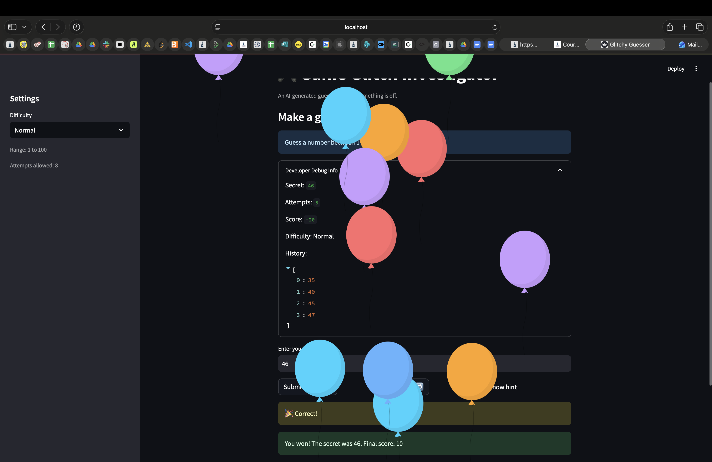

# 🎮 Game Glitch Investigator: The Impossible Guesser

## 🚨 The Situation

You asked an AI to build a simple "Number Guessing Game" using Streamlit.
It wrote the code, ran away, and now the game is unplayable. 

- You can't win.
- The hints lie to you.
- The secret number seems to have commitment issues.

## 🛠️ Setup

1. Install dependencies: `pip install -r requirements.txt`
2. Run the broken app: `python -m streamlit run app.py`

## 🕵️‍♂️ Your Mission

1. **Play the game.** Open the "Developer Debug Info" tab in the app to see the secret number. Try to win.
2. **Find the State Bug.** Why does the secret number change every time you click "Submit"? Ask ChatGPT: *"How do I keep a variable from resetting in Streamlit when I click a button?"*
3. **Fix the Logic.** The hints ("Higher/Lower") are wrong. Fix them.
4. **Refactor & Test.** - Move the logic into `logic_utils.py`.
   - Run `pytest` in your terminal.
   - Keep fixing until all tests pass!

## 📝 Document Your Experience

**What the game does:**
This is a number guessing game built with Streamlit. The player picks a difficulty (Easy, Normal, or Hard), then tries to guess a randomly chosen secret number within a limited number of attempts. After each guess, the game gives a hint telling the player whether to guess higher or lower. Points are awarded for winning, and more points go to players who win in fewer attempts.

**Bugs found:**
1. **Inverted hints** — the `check_guess` function returned "Go HIGHER!" when the guess was too high and "Go LOWER!" when it was too low. The messages were completely swapped which made it impossible to follow the hints to a correct answer.
2. **New Game button broken** — After winning, clicking the "New Game" button reset the attempts and the secret number but it never reset `st.session_state.status` back to `"playing"`. This caused the game to immediately stop again on every rerun which was trapping the player in a "You already won" loop.
3. **Hard difficulty easier than Normal** — The Hard mode used a range of 1–50 while Normal used 1–100 which made the level Hard objectively easier to guess correctly by chance.

**Fixes applied:**
- Moved all of the four game logic functions (`get_range_for_difficulty`, `parse_guess`, `check_guess`, `update_score`) from `app.py` into `logic_utils.py` to separate UI from game logic.
- Fixed `check_guess` so "Too High" maps to "Go LOWER!" and "Too Low" maps to "Go HIGHER!".
- Added `st.session_state.status = "playing"` to the New Game handler so the game fully resets on each new round.
- Removed the string/int conversion that was causing hints to flip behavior on every other attempt.
- Fixed the Hard difficulty range to 1–500 so it is actually harder than Normal.
- Updated the existing three pytest tests (which were comparing to a string instead of unpacking the tuple) and added two new tests targeting the inverted hint fix.

## 📸 Demo

## 🚀 Stretch Features

- [ ] [If you choose to complete Challenge 4, insert a screenshot of your Enhanced Game UI here]
